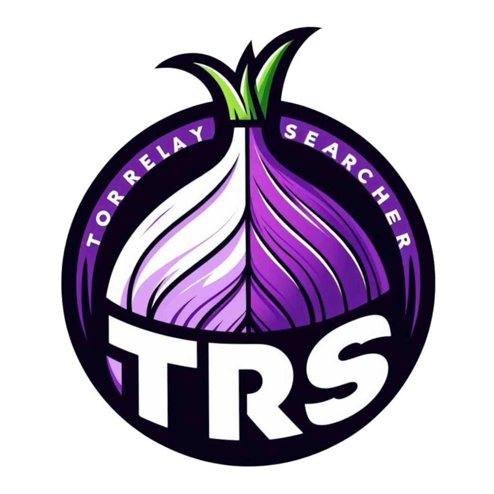
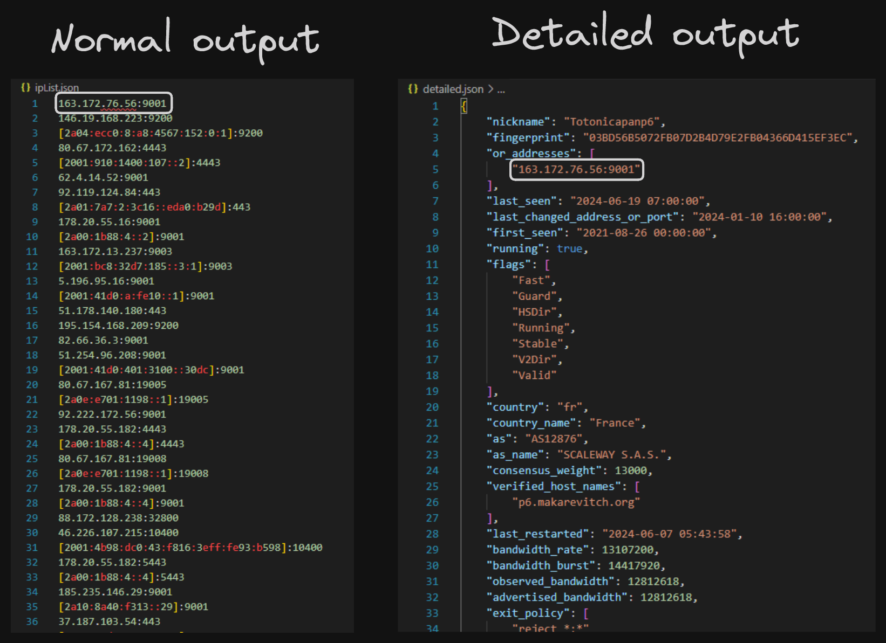

<h1 align="center">


_TOR RELAY SEARCHER_
</h1>

<h4 align="center">Python tool for searching active relays in the network.</h4>
<p align="center">
    <a href="https://github.com/Llo0zy/Tor-Relay-Searcher/commits/master">
    
    </a>
    <a href="https://github.com/Rug4lo/Log-Zapper/issues">
    
    </a>
    <a href="https://github.com/Rug4lo/Log-Zapper/pulls">
    
    </a>
</p>

## Table of Contents

- [What is Tor Relay Searcher?](#what-is-tor-relay-searcher)
- [How It Works](#how-it-works)
  - [Usage and Examples](#usage)
- [TODO List](#todo-list)
- [Disclaimer](#disclaimer)

## What is Tor Relay Searcher?
The Tor Relay Searcher (TRS) is a valuable tool for filtering Tor nodes, routers, or relays. It allows users to search for specific relays based on tags, country, or their last connection in the Tor network. TRS is written in Python and is compatible with multiple platforms, making it versatile for those working with Tor.

## How It Works
The code can be divided into three parts:
1. Obtaining the relays from the source
2. Configuring filter functions
3. Calling functions and displaying the output

Currently, the only source for obtaining relays is the main TOR API: [onionoo](https://onionoo.torproject.org/). After loading the JSON data, we create the class *searchRelay*, where we compare and execute programs to filter the requested data in the third step. As this is a beta version, the features are limited. The code is optimized to filter 8,000 relays in 6-7 seconds, depending on your internet connection.

We are still working on new features. If you find any errors in the program, please let me know through my Discord: `yoshl.`
**This program was programmed for Python version 3.11, other lower versions like: 3.9 and 3.10 works correctly. Python 3.12.4 can make more unknown errors.**

### Usage
Please note that the developer code (*TRS.py*) has more features than the command line code (*TRS.command.py*). 

- Dependencies of TRS.py: `pip install -r requeriments.dev.txt`
- Dependencies of TRS.command.py: `pip install -r requeriments.cmd.txt`

All usage will be demonstrated through the command line code.

#### Filter by Flags
The parameter *-af/--accurate-flags* allows us to filter by exact flags. If a relay has one additional flag, it will not appear. By default, this option is set to False.

```bash
python TRS.command.py --flags Exit Guard Stable V2Dir Running NoEdConsensus --accurate-flags True
python TRS.command.py -f Exit Guard Stable V2Dir Running NoEdConsensus -af True
```

#### Filter by Version
The flag parameters are *-v/--version* and *-rv/--recommended-version*. To avoid errors, it is recommended to use only *-rv*. Using both parameters simultaneously may result in errors such as:

```bash
'version' not registered for this relay.
```

Examples:

```bash
python TRS.command.py -vr True
python TRS.command.py --version 0.4.8.11 --recommended-version False
```

This parameter can cause some errors; we are working to fix it.

#### Save Output
You can save the output to a file using the parameter *-o/--output*. Additionally, you can combine it with the *--detailed* parameter to get more information about the relay, not just the *or_addresses*:

```bash
python TRS.command.py --flags Exit --output ipList.json
python TRS.command.py -f Exit -o detailed.json --detailed
```

An example file using the detailed parameter:



## TODO List
- [x] Output file
- [ ] Input file
- [ ] Filter by IP Relay
- [ ] Enable TRS.command.py in PYPI
- [ ] Async + Threading optimization
- [ ] Auto create a TOR circuit

## Disclaimer
Any actions and/or activities related to TRS/Tor Relay Seacher are solely your responsibility. The use of this tool may facilitate criminal or unethical activities. Contributors will not be held responsible for any cybercrime carried out directly or indirectly with this tool.

This code is shared for educational purposes.
